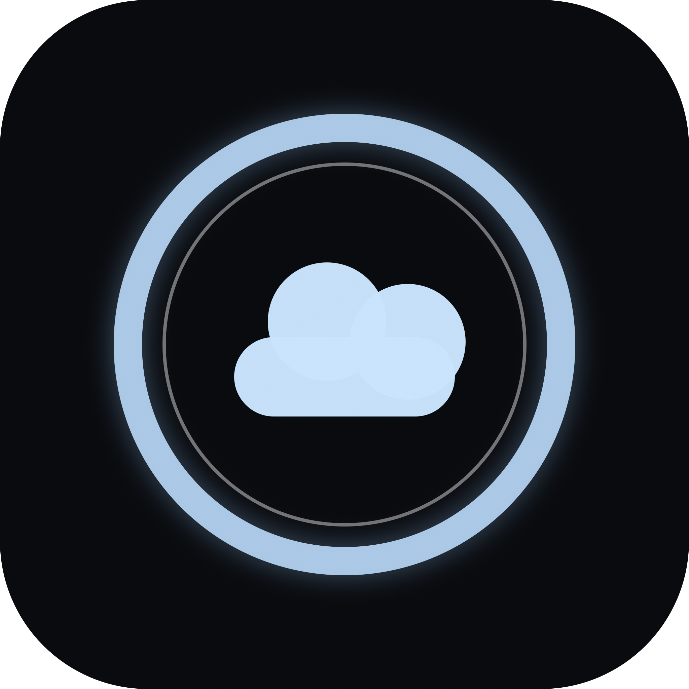
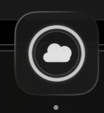
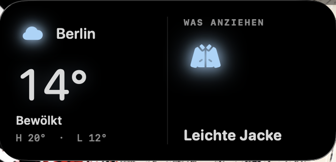
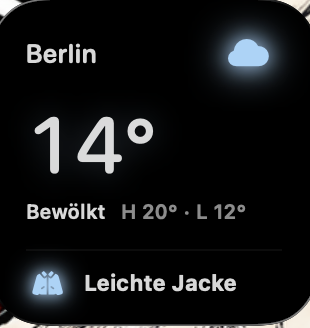
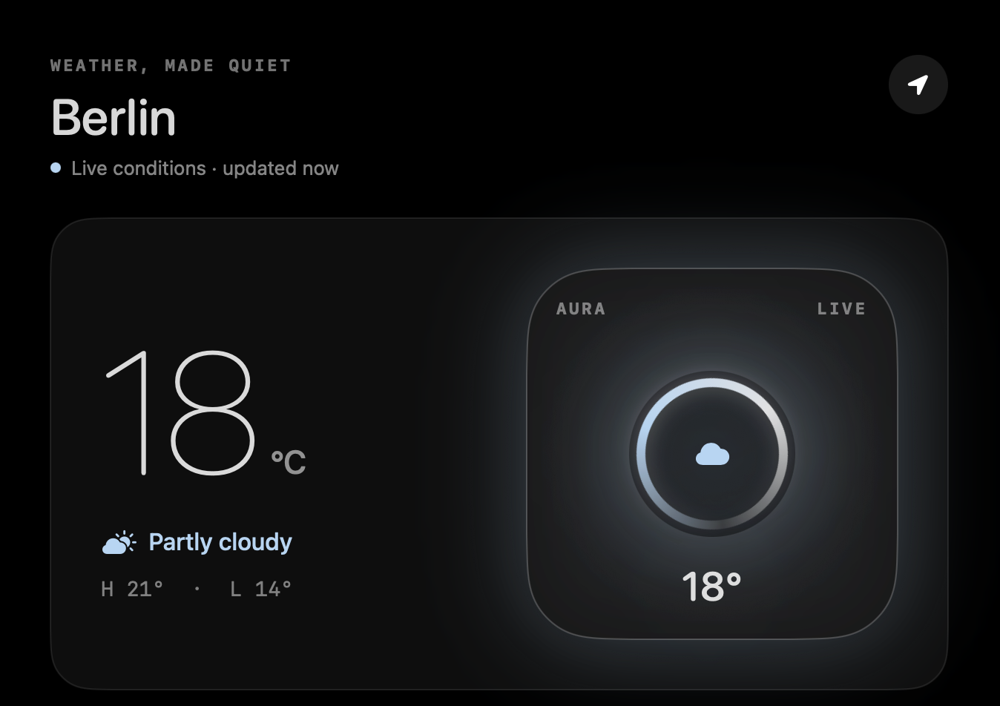
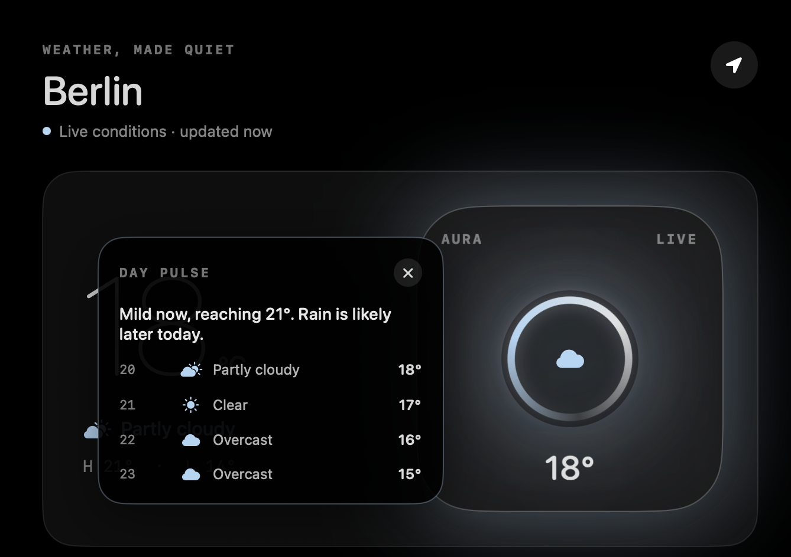
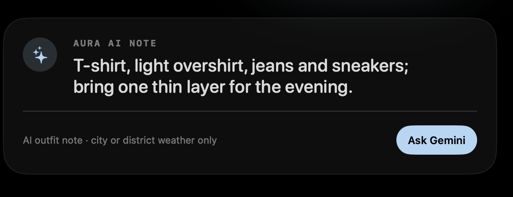
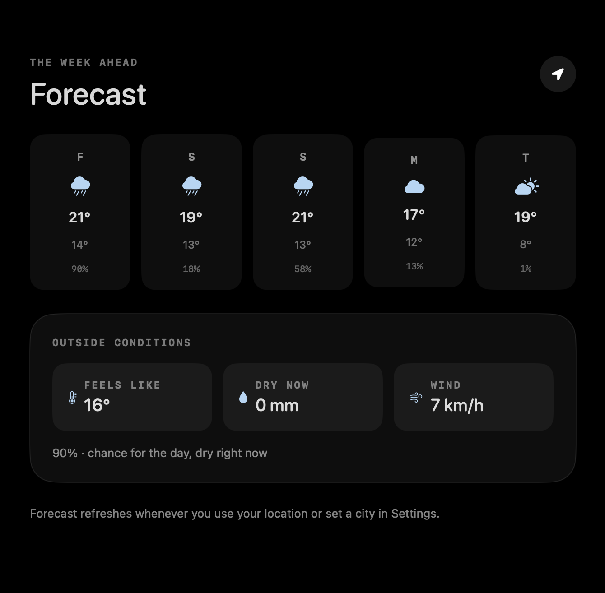
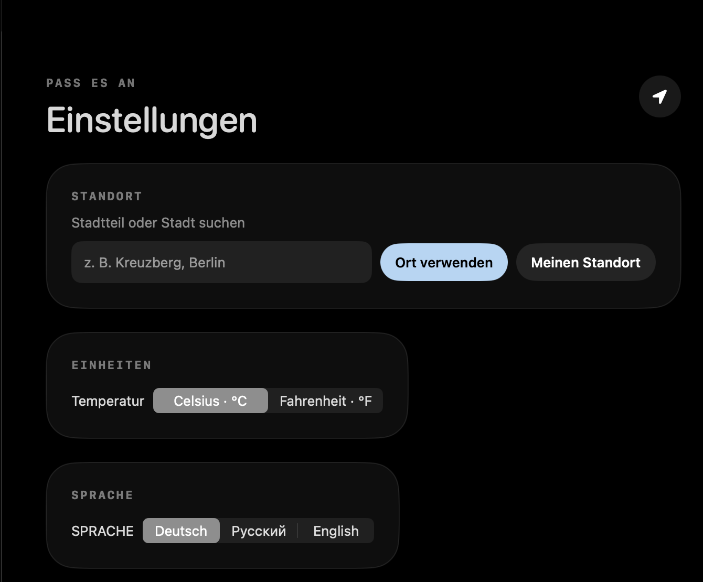
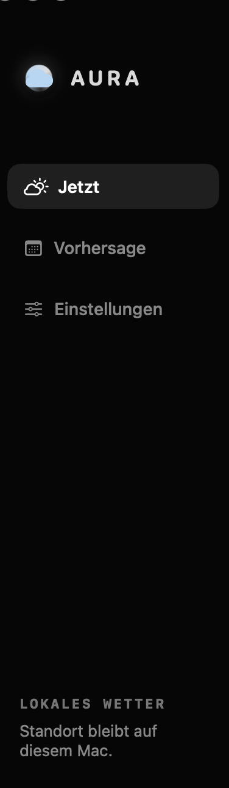

# SORAMOYO / 空模様 — Weather, made quiet

<p align="center">
  
</p>

**SORAMOYO** is a native macOS weather app that combines live local conditions with practical outfit guidance. Its name comes from the Japanese word **空模様** — the look of the sky or the state of the weather. It can use the Mac's location or search by city and district, presents a five-day forecast, and optionally asks Gemini for a concise clothing recommendation.

## Highlights

- **Live local weather** — current temperature, feels-like value, precipitation, wind and daily high/low data from Open-Meteo.
- **City and district search** — Core Location and geocoding support both the current Mac location and manually selected places.
- **Five-day forecast** — compact daily cards plus current outside conditions and precipitation context.
- **Hourly Day Pulse** — the liquid weather widget opens an animated summary of how conditions develop during the day.
- **macOS desktop widgets** — native small and medium WidgetKit layouts combine live weather with practical outfit guidance and weather-aware color accents.
- **Outfit guidance** — an offline rules engine always works; optional Gemini advice adds a short natural-language recommendation.
- **Three languages** — complete English, German and Russian interfaces, including weather conditions and outfit suggestions.
- **Privacy-conscious** — exact coordinates stay on the Mac. A Gemini key is stored in macOS Keychain and is never committed to the project.

## Product tour

### App identity

<p align="center">
  
</p>

The Dock icon turns SORAMOYO's central weather ring into a compact product mark. The cloud inside the luminous ring connects the icon directly to the live widget in the app.

### Native macOS widgets

#### Medium widget

<p align="center">
  
</p>

The medium layout separates live weather and outfit guidance into two clear columns. It shows the selected city, current temperature and condition, daily high and low, plus a localized recommendation with a matching clothing icon. Full-color symbols and blue ambient glow remain visible against the black-glass background.

#### Small widget

<p align="center">
  
</p>

The small layout keeps the same useful information in a compact vertical composition: city and weather icon at the top, temperature and daily range in the center, and the outfit recommendation below a subtle divider. Both layouts refresh through WidgetKit and follow SORAMOYO's English, German or Russian localization.

### Live weather overview

<p align="center">
  
</p>

The main view prioritizes the information needed before leaving: current temperature, condition, daily high and low, and a live visual widget. The location button refreshes weather using Core Location.

### Hourly Day Pulse

<p align="center">
  
</p>

Clicking the liquid weather widget opens an animated bubble panel with the next hourly conditions, temperatures and a short rain summary. It keeps detailed data one interaction away without crowding the main screen.

### Gemini outfit recommendation

<p align="center">
  
</p>

Gemini receives city- or district-level weather values, never exact coordinates, and returns one concise clothing recommendation. The response is validated before display; incomplete output falls back to SORAMOYO's local outfit engine.

### Five-day forecast

<p align="center">
  
</p>

The forecast combines daily high and low temperatures with condition icons and rain probability. A separate conditions panel explains the current feels-like temperature, precipitation and wind.

### German settings

<p align="center">
  
</p>

Settings support automatic location, manual city or district search, Celsius and Fahrenheit, and instant language switching. This screen demonstrates the complete German localization rather than a partially translated interface.

### Localized navigation

<p align="center">
  
</p>

Navigation, privacy copy, weather labels and outfit guidance all follow the selected language. English, German and Russian are implemented across the complete app flow.

## Tech stack

- Swift 5 and SwiftUI
- WidgetKit with small and medium macOS desktop widgets
- Core Location and CLGeocoder
- URLSession with the Open-Meteo REST API
- Gemini API for optional outfit advice
- macOS Keychain Services
- XCTest

## Run locally

Requirements: macOS 14 or newer and Xcode command-line tools.

```sh
swift run
```

Build the standalone app bundle:

```sh
zsh Scripts/build-app.sh
open outputs/Soramoyo.app
```

Gemini is optional. Add your own API key inside SORAMOYO Settings; the local weather and outfit engine work without it.

## Project structure

```text
Sources/AuraWeather/   SwiftUI app, weather service and localization
Widget/                Native macOS WidgetKit extension
Tests/AuraWeatherTests Local outfit-engine tests
Assets/                App icon and portfolio screenshots
Scripts/               Standalone macOS app build helper
```

## Status

SORAMOYO is a portfolio project built to demonstrate native macOS development, API integration, localization, secure secret storage and product-focused UI design.
