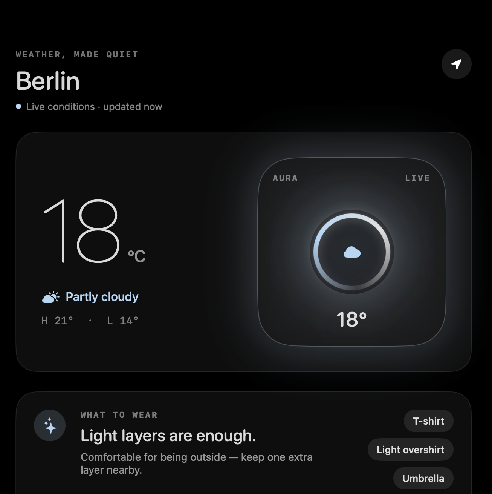
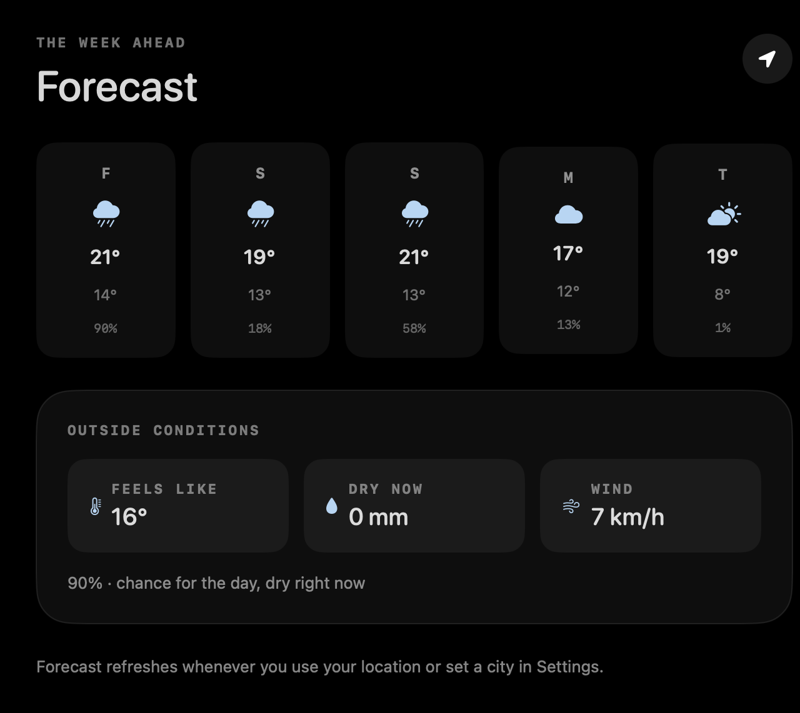
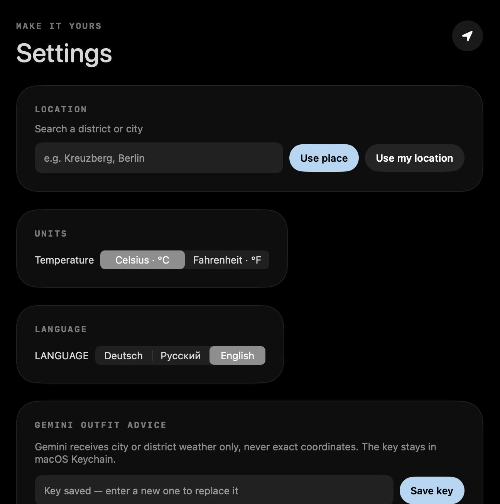
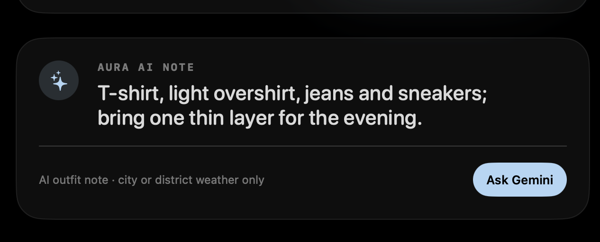

# AURA — Weather, made quiet

<p align="center">
  
</p>

**AURA** is a native macOS weather app that combines live local conditions with practical outfit guidance. It can use the Mac's location or search by city and district, presents a five-day forecast, and optionally asks Gemini for a concise clothing recommendation.

<p align="center">
  
</p>

## Highlights

- **Live local weather** — current temperature, feels-like value, precipitation, wind and daily high/low data from Open-Meteo.
- **City and district search** — Core Location and geocoding support both the current Mac location and manually selected places.
- **Five-day forecast** — compact daily cards plus current outside conditions and precipitation context.
- **Hourly Day Pulse** — the liquid weather widget opens an animated summary of how conditions develop during the day.
- **Outfit guidance** — an offline rules engine always works; optional Gemini advice adds a short natural-language recommendation.
- **Three languages** — complete English, German and Russian interfaces, including weather conditions and outfit suggestions.
- **Privacy-conscious** — exact coordinates stay on the Mac. A Gemini key is stored in macOS Keychain and is never committed to the project.

<p align="center">
  
  
</p>

## Gemini outfit advice

Gemini receives only city- or district-level weather values, not exact coordinates. The response is validated before display; incomplete output falls back to AURA's local outfit engine.

<p align="center">
  
</p>

## Tech stack

- Swift 5 and SwiftUI
- Core Location and CLGeocoder
- URLSession with the Open-Meteo REST API
- Gemini API for optional outfit advice
- macOS Keychain Services
- XCTest

## Run locally

Requirements: macOS 14 or newer and Xcode command-line tools.

```sh
swift run
```

Build the standalone app bundle:

```sh
zsh Scripts/build-app.sh
open outputs/Aura.app
```

Gemini is optional. Add your own API key inside AURA Settings; the local weather and outfit engine work without it.

## Project structure

```text
Sources/AuraWeather/   SwiftUI app, weather service and localization
Tests/AuraWeatherTests Local outfit-engine tests
Assets/                App icon and portfolio screenshots
Scripts/               Standalone macOS app build helper
```

## Status

AURA is a portfolio project built to demonstrate native macOS development, API integration, localization, secure secret storage and product-focused UI design.
